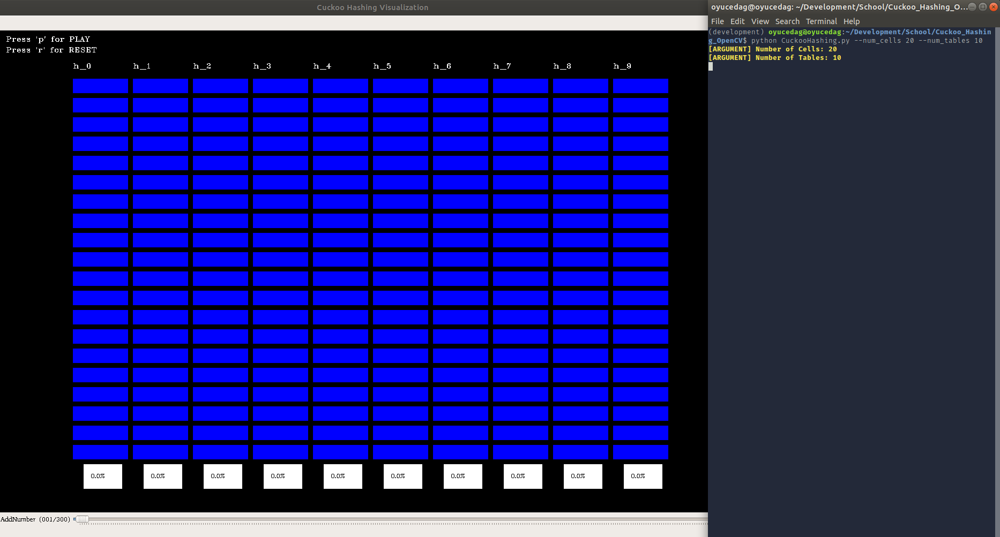
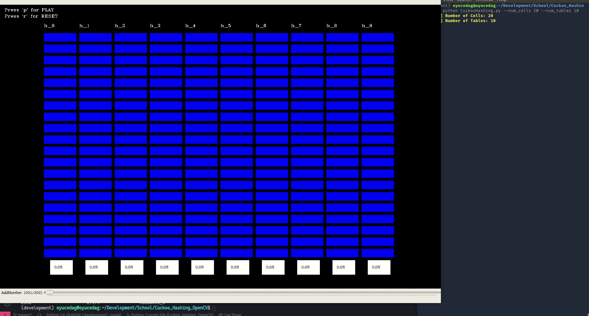
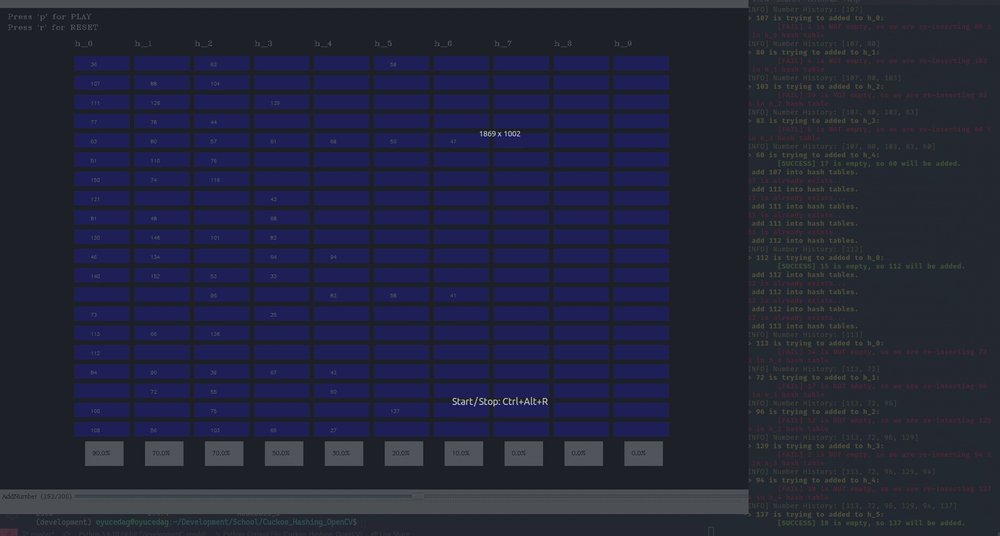
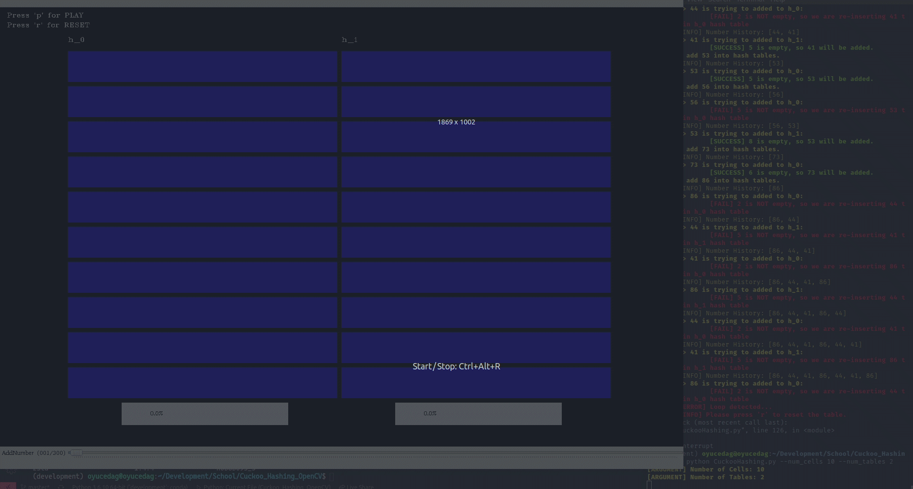

# Cuckoo Hashing OpenCV

Cuckoo Hashing visualization using OpenCV as a GUI.

## Requirements

1. Python 3.+
2. OpenCV bindings for Python:
   1. `pip install opencv-python` : [Source](https://pypi.org/project/opencv-python/)
3. NumPy 1.18
   1. `pip install numpy` : [Source](https://pypi.org/project/numpy/)

4. *[NOTE]: If you are using Conda environment you can use `requirements.txt`:*
    - `conda create --file requirements.txt`

## How to run it?

1. `python CuckooHashing.py --num_cells 20 --num_tables 10` will open a window for visualization of the algorithm:
   1. 
2. You should see a slider below of the window. You can use it to select a number to insert into hash tables:
   1. 
3. Also, you can see occupancy rate for each table on bottom of the window:
   1. 
4. For actually adding the number into hash tables, press **p (play)**. When you press it, cells that are going to be used for insertion will light up one by one. So, if there is an occulusion at insertion of a number, it will insert the new number into occluded cell and try another hash table for insertion for the old number. You can see all the dynamics:
   1. 
   2. You can also see the log messages from the terminal:
      1. It will print different message types with different color.
      2. It will print:
         1. Number that currently wanted to be inserted.
         2. Cell that is currently to be used for insertion.
         3. Whether a number is already in hash tables or not.
         4. Whether there is an occlusion during the insertion or not.
5. Finally, if there are cycles you can always use **r (reset)** button to reset the hash tables. Terminal will inform you whether you need to reset the tables or not:
   1. 